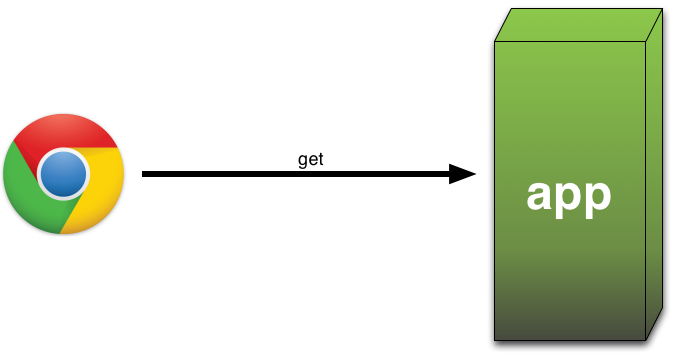
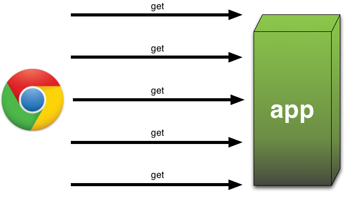
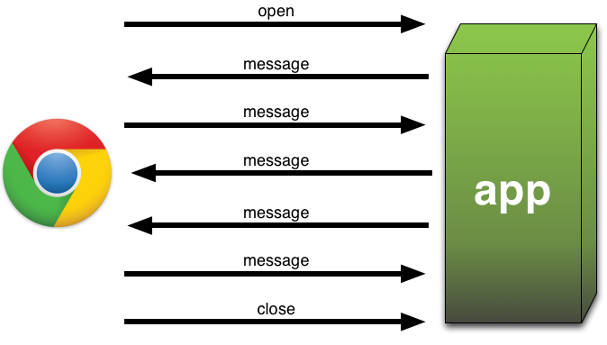

!SLIDE subsection center
# Websockets

!SLIDE

!SLIDE center 
# Pull

!SLIDE center
# Poll

!SLIDE center
# Websockets

!SLIDE screenshot center w3c
# [W3C Draft](http://dev.w3.org/html5/websockets/)

!SLIDE smaller
# Standard Events

    @@@ javascript
    var connection = new WebSocket(/* url */);

    connection.onopen = /* function */;

    connection.onmessage = /* function(event) */;

    connection.onerror = /* function(error) */;

    connection.onclose = /* function */;

!SLIDE screenshot center socketio
# [socket.io](http://socket.io)

!SLIDE center bullets incremental
# Features Great Compatibility

Has fallback depending on your browser

* Websockets
* Flash sockets
* Long Polling
* Short Polling
* ... It usually just works!

!SLIDE smaller
# Again, Great in Browser ...

    @@@ html
    
    

!SLIDE smaller
# ... And on Server!

    @@@ javascript
    var app = require('express').createServer()
      , io = require('socket.io').listen(app);

    app.listen(80);

    io.sockets.on('connection', function (socket) {
      socket.emit('news', { hello: 'world' });
      socket.on('my other event', function (data) {
        console.log(data);
      });
    });

!SLIDE smaller
# on() Events

    @@@ javascript
    // connection event on all sockets
    io.sockets.on('connection', function(socket) {
      // setup to handle your own events
      socket.on('foo', function(data) {
        // socket.io handles deserialization of data
      });

      // and gracefully handle disconnections
      socket.on('disconnect',function() {
      });
    });

!SLIDE smaller
# Send events with <code>emit()</code>

    @@@ javascript
    // data is automatically serialized!
    socket.emit('foo', data);

!SLIDE semantics smaller
# An Example

* ### Server

      @@@ javascript
      io.sockets.on('connection', 
        function (socket) {
          socket
            .on('my other event', 
                function (data) {
                  console.log(data);
            })
            .emit('news',
                  { hello : 'world' });
      });

* ### Client

      @@@ javascript
      socket.on('news', 
        function (data) {
          socket.emit('my other event', 
                      { my: 'data' });
      });
 
!SLIDE center screenshot online
# [Who's Online](http://localhost:8500)

!SLIDE smaller incremental
# Use Namespace to Handle Just Lobby Connections

* Client

      @@@ javascript
      io.connect('/lobby');

* Server

      @@@ javascript
      var lobby =
        io.of('/lobby').on('connection',
          function(socket) {
            ...
            // send a message to all
            lobby.emit('message', data);
            ...
        });

!SLIDE
# Build Each Page Like It's Own Little App

!SLIDE subsection center
# Multiplayer Game!

!SLIDE
# Javascript Everywhere Allows You To Move Logic From Client to Server ... and Back!

!SLIDE smaller
# Express: <code>get()</code>-ing Parameters

Parameters can be pulled from the path:

    @@@ javascript
    app.get('/path/:foo/:bar', function(req, res) {
      // var fooValue = req.params.foo;
      // var barValue = req.params.bar;
    });

!SLIDE smaller
# Connecting to a Game

    @@@ javascript
    app.get('/game/:player/:id', 
      authenticate, 
      function( req, res ) {
        res.render('nodebro.js.jade', {
          nickname:req.session.nickname,
          isHost : req.params.player == '1' ? true : false,
          gameId:req.params.id
      });
    });
    
!SLIDE smaller
# Client Sends Game Id

    @@@ javascript
    game = io.connect('/game');

    game.on('connect', function () {
      game.emit('join', 
                { nickname:nickname, 
                  gameId:gameId, 
                  isHost:isHost});
        ..

!SLIDE smaller
# Server <code>join()</code>s them to a Room

    @@@ javascript
    var gameSockets = 
      io.of('/game')
        .on('connection', function(socket) {
          socket.on('join', function(data) {
            var room = socket.join( data.gameId );
            ...

!SLIDE smaller
# Game Events sent <code>to(room)</code>

    @@@ javascript
    function gameEvent( type, data ) {
      sockets.to(gameId).emit( type, data );
    }
    
