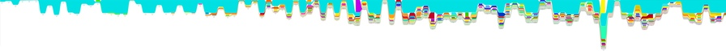
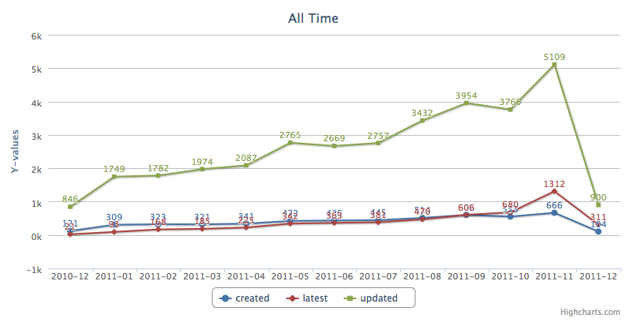

!SLIDE
# What is ?

!SLIDE
# JavaScript on the Server

!SLIDE bullets incremental center v8

<ul>
<li class="system-logo chrome"></li>
<li class="system-events browser">

load

click

submit

</li>
<li class="system-logo nodejs"></li>
<li class="system-events server">

connect

read

open

</li>
</ul>

!SLIDE full-page=ryandahl.png
# Ryan Dahl

[@ryan](http://twitter.com/ryah)

[http://github.com/ryah](http://github.com/ryah)

!SLIDE bullets incremental
# Growth

* 

!SLIDE bullets incremental
# Growth

* 

  source: [Mashable](http://mashable.com/2011/03/10/node-js/)

!SLIDE bullets incremental
# Libraries

* 

  source: [NPM Registry](http://search.npmjs.org/)

!SLIDE bullets incremental
# #1 Watched

* 
