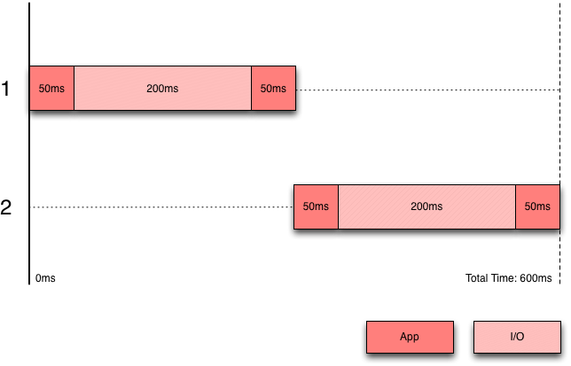
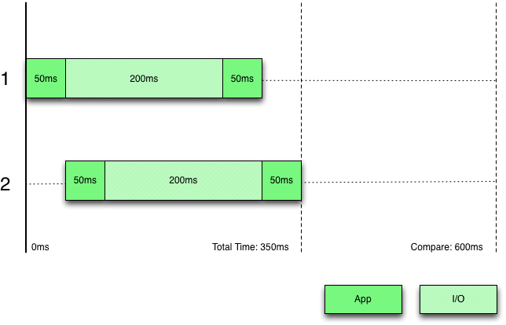

!SLIDE
# What's the Big Deal?

!SLIDE
# STUPIDEST REASON?

!SLIDE
# It's HAWT, bro!

!SLIDE

!SLIDE
# Same Language Everywhere

    @@@ javascript
    setTimeout(function() {
      console.log('World!');
    }, 2000);

    console.log("Hello!");

!SLIDE
# "Non-Blocking" I/O

!SLIDE
# Evented I/O

!SLIDE smaller incremental

* Ruby

      @@@ ruby
      def index
        count = Users.count
        render :text => count
      end

* Javascript

      @@@ javascript
      app.get('/', function(req,res) {
        users.count(function(err,count) {
          res.send(count);
        });
      });

!SLIDE incremental small
# Scenario

* 1 process running our app
* 2 requests come in concurrently
* For each request:
  * 50ms of processing
  * 200ms to run a database query
  * 50ms to generate a response
* How long will it take?

!SLIDE center
# Blocking

!SLIDE center
# Non-Blocking

!SLIDE command smaller
# helloWorldServerTimeout.js

    @@@ javascript
    var http = require('http');
    var server = http.createServer(function (req, res) {
      setTimeout(function() {
        res.writeHead(200, {
          'Content-Type': 'text/plain'
        });
        res.end('Hello World\n');
      },2000);
    });

    server.listen(1337, "127.0.0.1");

    console.log(
      'Server running at http://127.0.0.1:1337/'
    );

!SLIDE commandline incremental

    $ siege -b -c 10 -r 1 http://127.0.0.1:1337/
    ** SIEGE 2.70
    ** Preparing 10 concurrent users for battle.
    The server is now under siege...
    ...
    done.
    Transactions:                     10 hits
    Availability:                 100.00 %
    Elapsed time:                   2.01 secs
    Data transferred:               0.00 MB
    Response time:                  2.01 secs
    Transaction rate:               4.98 trans/sec
    Throughput:                     0.00 MB/sec
    Concurrency:                   10.00
    Successful transactions:          10
    Failed transactions:               0
    Longest transaction:            2.01
    Shortest transaction:           2.01

!SLIDE commandline incremental

    $ siege -b -c 100 -r 1 http://127.0.0.1:1337/
    ** SIEGE 2.70
    ** Preparing 250 concurrent users for battle.
    The server is now under siege...
    done.
    Transactions:                    100 hits
    Availability:                 100.00 %
    Elapsed time:                   2.03 secs
    Data transferred:               0.00 MB
    Response time:                  2.00 secs
    Transaction rate:              49.26 trans/sec
    Throughput:                     0.00 MB/sec
    Concurrency:                   98.60
    Successful transactions:         100
    Failed transactions:               0
    Longest transaction:            2.01
    Shortest transaction:           2.00

!SLIDE commandline incremental

    $ siege -b -c 250 -r 1 http://127.0.0.1:1337/
    ** SIEGE 2.70
    ** Preparing 250 concurrent users for battle.
    The server is now under siege...
    ...
    done.
    Transactions:                    250 hits
    Availability:                 100.00 %
    Elapsed time:                   4.00 secs
    Data transferred:               0.00 MB
    Response time:                  2.01 secs
    Transaction rate:              62.50 trans/sec
    Throughput:                     0.00 MB/sec
    Concurrency:                  125.47
    Successful transactions:         250
    Failed transactions:               0
    Longest transaction:            3.83
    Shortest transaction:           1.99

!SLIDE incremental
# Not the Only Event In Town

* [EventMachine]()
* [Tornado]()
